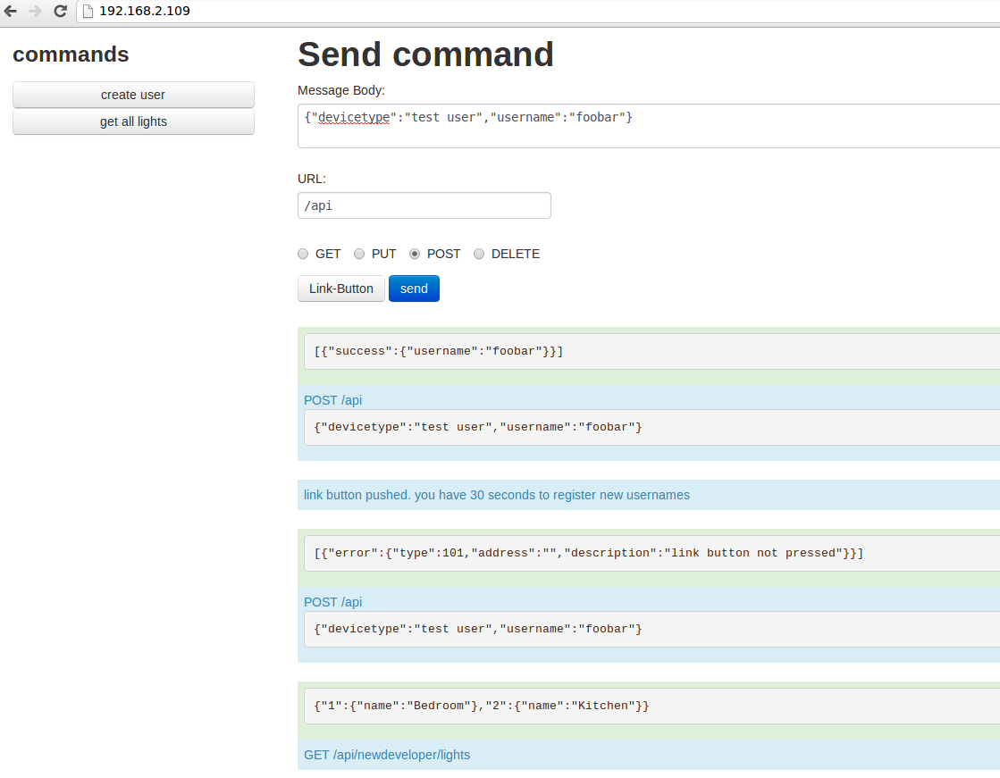

# A node.js based simulator for the Philips Hue API

As I started development of hueJS before getting my Hue starter kit, i needed to test my code with a simulated bridge.

## Install

Using npm:

```sh
sudo npm install -g hue-simulator
```

It should be installed [globally](http://blog.nodejitsu.com/npm-cheatsheet#Understanding_Global_versus_Local_installs_in_npm) by default, so you can start the simulator via command line, but to be sure we are adding the `-g` flag.

## Run

Start the simulator via command line (if installed globally):

```sh
# start the simulator on localhost:80
sudo hue-simulator

# start the simulator on localhost:8080 #
hue-simulator --port=8080

# start the simulator on 127.0.3.1:80 #
sudo ifconfig lo0 alias 127.0.3.1
sudo hue-simulator --hostname=127.0.3.1
```

Sudo is necessary when we want to listen on port 80, a so called low-port that are restricted to the unix root user.

## Debugger

There is a webinterface where you can enter commands similar to the debugger of the real bridge. After starting the simulator, simply navigate your browser to the IP of the simulator.

In the list on the left there are predefined commands, so you don't always have to look up the correct URL and write the whole JSON-body of the message. Click on a button, and the command-form is filled with dummy data for this kind of command.

## Routes

`GET /linkbutton` will enable user registration for 30 seconds. By default, a user named "newdeveloper" is whitelisted. Registered users and state of the simulator will be lost when restarting. So you always have a "fresh" system.

At the moment, all routes from the hue API are available, except schedules.

